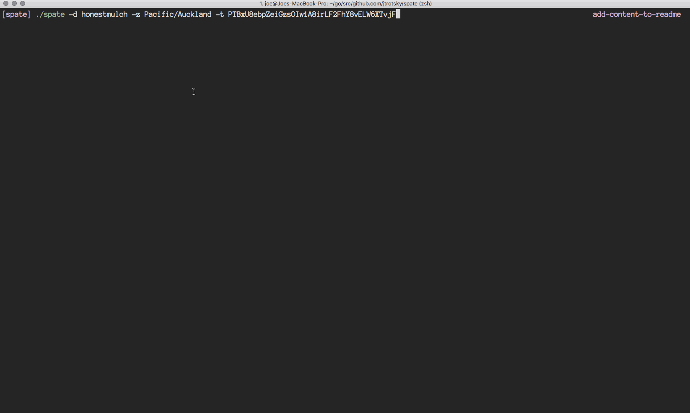

#### SPATE
_A command line Go tool for exporting sales in bulk from a Vend store._

### Disclaimer
Use this tool at your own risk. This is a third-party tool with no affiliation to Vend; and
was built solely for the purpose of making it easier for retailers to export sales from Vend.
If you are using this tool on behalf of a retailer (with explicit permission), sale information produced from this report
is sensitive, so please be careful and respect the privacy of the store owner.

### Arguments
```
-d Domain prefix. The name of the Vend store (prefix of xxxx.vendhq.com).
-t API Access Token. Generated from Setup -> Personal Tokens.
-z Timezone. In zoneinfo format. The default is to try and use the computer's local timezone.
```

### Example Usage
```
./spate -d honestmulch -z Pacific/Auckland -t oe1R9xoQeJRUdyVkz6trbcf9GnUTBovJWKRSBCEf
```


